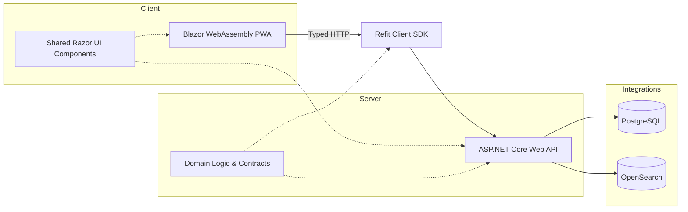
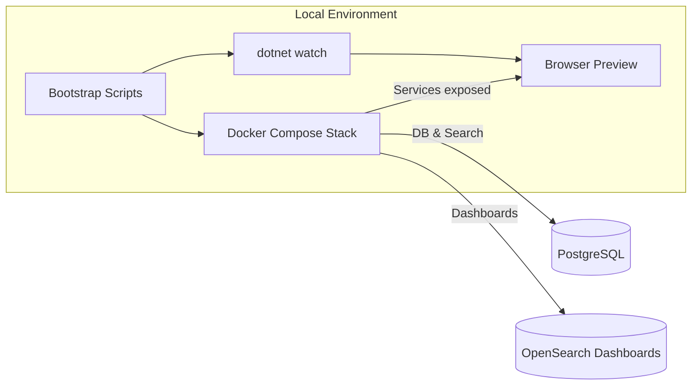
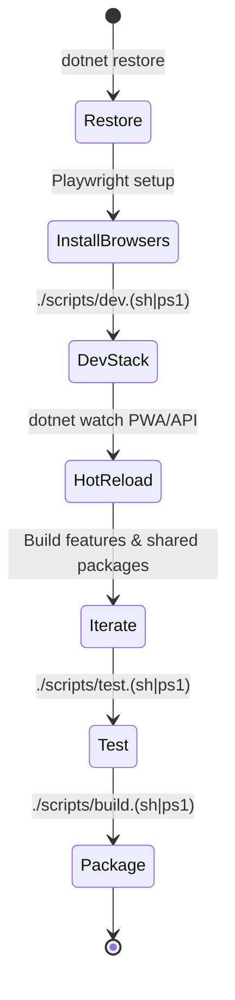
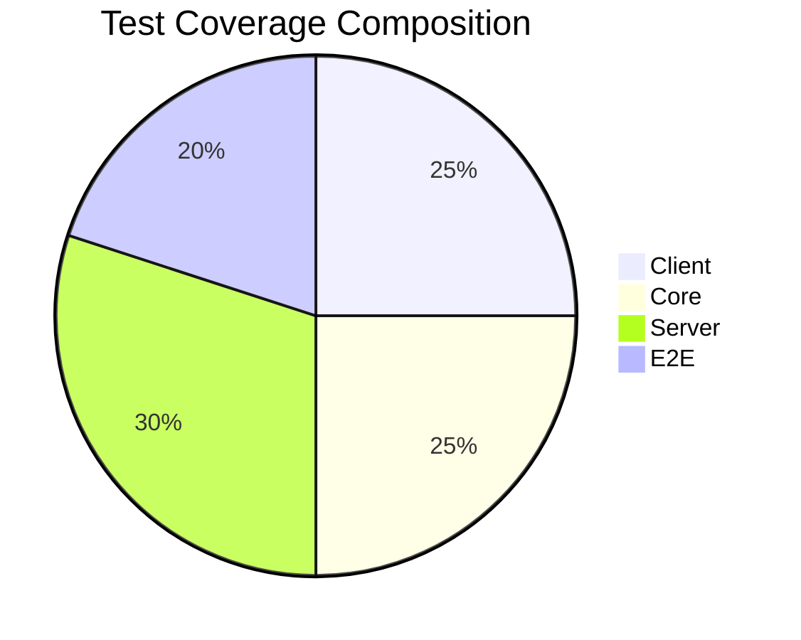
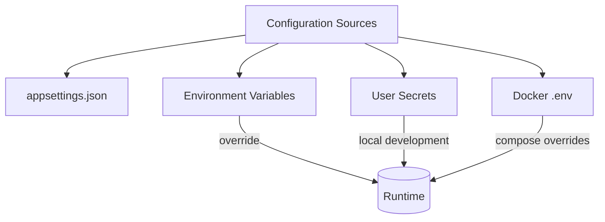
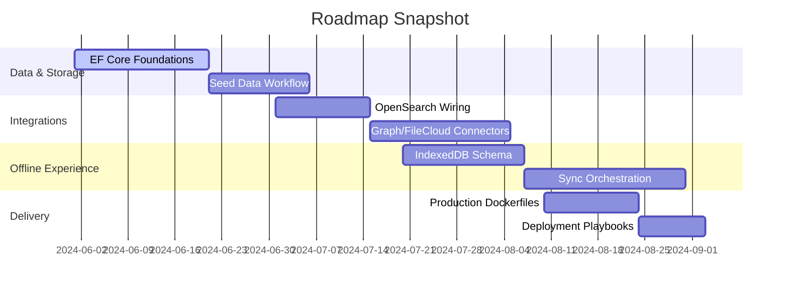

# SPOT

<div align="center">
  
  <h3>Streamlined Platform for Offline-first Teams</h3>
  <p>
    SPOT is a .NET 8 monorepo delivering a Blazor WebAssembly PWA, ASP.NET Core Web API, shared Razor UI components,
    domain logic, and typed client SDKs — crafted for deterministic tooling, offline-ready workflows, and infrastructure parity.
  </p>
</div>

<div align="center">
  
  
  
  
  
</div>

<br />

> _"Designing resilient offline-first experiences with delightful developer ergonomics."_

---

## Table of Contents

1. [Highlights](#highlights)
2. [Architecture at a Glance](#architecture-at-a-glance)
3. [Repository Layout](#repository-layout)
4. [Tech Stack](#tech-stack)
5. [Prerequisites](#prerequisites)
6. [Quickstart](#quickstart)
7. [Developer Workflow](#developer-workflow)
8. [Testing Matrix](#testing-matrix)
9. [Scripts & Automation](#scripts--automation)
10. [Configuration & Secrets](#configuration--secrets)
11. [Troubleshooting](#troubleshooting)
12. [Next Steps](#next-steps)
13. [Contributing](#contributing)

---

## Highlights

<table>
  <tr>
    <td align="center">🚀<br /><strong>Unified Monorepo</strong><br /><sub>Apps, shared packages, infrastructure, and tests live side-by-side for tight cohesion.</sub></td>
    <td align="center">🧭<br /><strong>Offline-First Mindset</strong><br /><sub>Typed clients and mirrored infra make disconnected scenarios a first-class concern.</sub></td>
    <td align="center">🧪<br /><strong>Deterministic Tooling</strong><br /><sub>`just` recipes & scripts guarantee the same commands across macOS, Windows, and Linux.</sub></td>
  </tr>
  <tr>
    <td align="center">🧱<br /><strong>Composable UI</strong><br /><sub>Shared Razor component library powers the PWA and future host experiences.</sub></td>
    <td align="center">🔐<br /><strong>Secure by Configuration</strong><br /><sub>Environment variables & secrets management keep credentials out of source control.</sub></td>
    <td align="center">⚡<br /><strong>Dev Ergonomics</strong><br /><sub>Hot reload, Playwright automation, and Docker parity keep delivery fast and confident.</sub></td>
  </tr>
</table>

---

## Architecture at a Glance



---

## Repository Layout

```
spot.sln
apps/
  web/Spot.Web/              # Blazor WebAssembly PWA
  server/Spot.Api/           # ASP.NET Core Web API
packages/
  ui/Spot.UI/                # Shared Razor components
  core/Spot.Core/            # Domain models and contracts
  client-sdk/Spot.ClientSdk/ # Typed API client (Refit)
infra/
  docker-compose.yml         # Local + on-prem infrastructure
scripts/                     # Cross-platform automation helpers
tests/
  client.tests/              # Client unit tests
  core.tests/                # Domain unit tests
  server.tests/              # API integration/unit tests
  e2e/                       # Playwright smoke tests
.github/workflows/ci.yml
```

---

## Tech Stack

| Area            | Technologies |
|-----------------|--------------|
| Frontend        | Blazor WebAssembly, Razor Components, TypeScript (Playwright) |
| Backend         | ASP.NET Core 8, Minimal APIs (planned), Entity Framework Core (incoming) |
| Shared Packages | Domain contracts, UI components, Refit-based HTTP clients |
| Infrastructure  | Docker Compose, PostgreSQL, OpenSearch, GitHub Actions |
| Tooling         | `dotnet` CLI, `just`, PowerShell 7+, Playwright |

---

## Prerequisites

> Install the following before cloning or running commands:

- [.NET SDK 8.0](https://dotnet.microsoft.com/download/dotnet/8.0)
- [Node.js 18+](https://nodejs.org/) (for Playwright installation)
- [Docker Desktop or Docker Engine](https://docs.docker.com/get-docker/)
- PowerShell 7+ **or** a POSIX shell (macOS/Linux/WSL2)

**Optional but recommended**

- [just](https://github.com/casey/just) command runner
- `npx playwright install --with-deps` (once per machine) to set up browsers for E2E tests

---

## Quickstart

> ℹ️ Ensure Docker Desktop (Windows/macOS) or Docker Engine (Linux) is running before launching the dev scripts; otherwise the watchdog will exit early.

```bash
# restore tools & dependencies
dotnet restore

# install Playwright browsers (first run only)
npx playwright install --with-deps

# start the full dev stack (Docker + watchers + browser)
./scripts/dev.sh
# or on Windows PowerShell
./scripts/dev.ps1
```

When the script completes, the following services are available:

| Service | URL |
|---------|-----|
| API | `http://localhost:5187` (Swagger UI at `/swagger`) |
| PWA | `http://localhost:5173` |
| OpenSearch Dashboards | `http://localhost:5601` |
| PostgreSQL | `localhost:5432` |



---

## Developer Workflow

1. ✅ Clone the repo and run `dotnet restore` to hydrate SDK workloads.
2. 🧰 Install Playwright browsers using `npx playwright install --with-deps` (first run only).
3. 🐳 Launch the full stack via `./scripts/dev.sh` (macOS/Linux) or `./scripts/dev.ps1` (Windows).
4. 🔄 Hot reload kicks in via `dotnet watch` for both API and PWA.
5. 🧩 Update shared packages (`packages/*`) to evolve domain contracts and UI simultaneously.
6. 🧪 Run `./scripts/test.sh` (or `./scripts/test.ps1`) before committing; append `--include-e2e` for Playwright smoke coverage.
7. 📦 Use `./scripts/build.(sh|ps1)` to produce deterministic publish outputs in `artifacts/`.

> Have `just` installed? Mirror commands as `just dev`, `just test`, `just build`, and more.



---

## Testing Matrix

| Command | Coverage | Notes |
|---------|----------|-------|
| `./scripts/test.sh` | Client, Core, Server unit/integration suites | CI-safe default |
| `./scripts/test.sh --include-e2e` | All of the above + Playwright smoke | Requires running PWA/API |
| `dotnet test spot.sln` | Raw .NET runner | Useful inside CI or containers |
| `npx playwright test` | Standalone E2E | Targets running PWA at `http://localhost:5173` |



---

## Scripts & Automation

| Script | Description |
|--------|-------------|
| `./scripts/dev.(sh|ps1)` | Boots Docker services, applies EF Core migrations (no-op today), runs API & PWA watchers, opens the PWA. |
| `./scripts/build.(sh|ps1)` | Deterministic restore + build + publish to `artifacts/`. |
| `./scripts/test.(sh|ps1)` | Executes unit/integration suites; optional `--include-e2e`. |
| `./scripts/migrate.(sh|ps1)` | Runs `dotnet ef database update` against configured PostgreSQL instance. |
| `./scripts/seed.(sh|ps1)` | Placeholder for future data seeding workflows. |

---

## Configuration & Secrets

- Configuration defaults live in `appsettings.json` files; override via environment variables.
- Connection strings and API keys **must** be supplied via environment variables or [User Secrets](https://learn.microsoft.com/aspnet/core/security/app-secrets).
- Docker stack expects `POSTGRES_PASSWORD` and `OPENSEARCH_INITIAL_ADMIN_PASSWORD`. Provide a local `.env` (gitignored) or export env vars before running scripts.
- Playwright caches browsers under `~/.cache/ms-playwright` — share across projects or CI runners for faster installs.



---

## Troubleshooting

| Symptom | Resolution |
|---------|------------|
| Docker containers exit immediately | Ensure virtualization is enabled and rerun `docker compose up --pull always` inside `infra/`. |
| Playwright tests fail with missing browsers | Re-run `npx playwright install --with-deps` and ensure the PWA is reachable at `http://localhost:5173`. |
| `dotnet restore` uses unexpected SDK | Confirm the global.json (future addition) or run `dotnet --version` to verify 8.0.x. |
| `./scripts/dev.ps1` exits with `Docker is required to run the dev environment.` | Install Docker Desktop (or enable Docker Engine) and ensure it is running before re-running the script. |
| Windows shows `open //./pipe/docker_engine` or "docker client must be run with elevated privileges" | Launch Docker Desktop as Administrator once or add your account to the local **docker-users** group (`net localgroup docker-users %USERNAME% /add`), then sign out/in before rerunning the dev script. |
| Ports already in use | Stop lingering containers (`docker ps -a`) or adjust compose overrides with alternative ports. |

---

## Next Steps

- Implement EF Core DbContext and seed data migrations.
- Integrate OpenSearch client wiring and Microsoft Graph/FileCloud adapters.
- Flesh out offline sync flow and IndexedDB schema.
- Add production-ready Dockerfiles and deployment workflows.



---

## Contributing

1. Fork the repository and create a feature branch (`git checkout -b feature/amazing-idea`).
2. Follow the [Developer Workflow](#developer-workflow) to set up the environment.
3. Ensure linting/tests pass via `./scripts/test.sh` (and Playwright as needed).
4. Commit with conventional-style messages (e.g., `feat: add new sync strategy`).
5. Open a Pull Request summarizing motivation, changes, and testing.

🙌 Thank you for helping shape SPOT!

---

<p align="center"><sub>Crafted with care to keep teams productive both online and offline.</sub></p>
